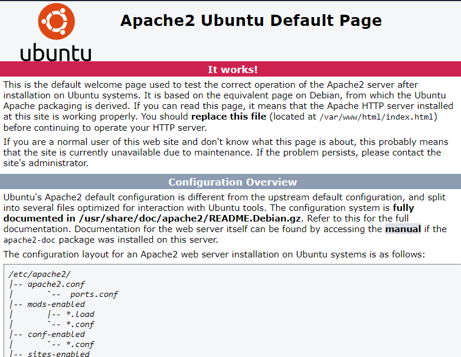

# Rekognition
Making a face recognition system by using AWS Rekognition API

## In this project we are going to deploy 3 servers on AWS Cloud:
- Frontend on Apache web server
- Backend using flask package
- Database storage

Let's start with Frontend
## Frontend
- EC2 instance: Ubuntu free tier
- Attach to VPC and Public Subnet
- Security Group: TCP 22 from your IP, HTTP 80, Custom TCP 5000
- Connect to EC2 instance
``ssh -i "<your_keypair.pem>" ubuntu@<PublicIPaddress_of_EC2``
- Installation of Apache server
`apt-get update
sudo apt install apache2
sudo ufw allow 'Apache'
sudo ufw status
sudo systemctl status apache2`
- You should see picture as below if it is properly installed:

Permission:
sudo chown -R ubuntu:ubuntu .

Backend
you might want to try this:

for anaconda 2 :
``export PATH=~/anaconda2/bin:$PATH``

for anaconda 3 :
``export PATH=~/anaconda3/bin:$PATH``

# Suggest as attendance check at University
