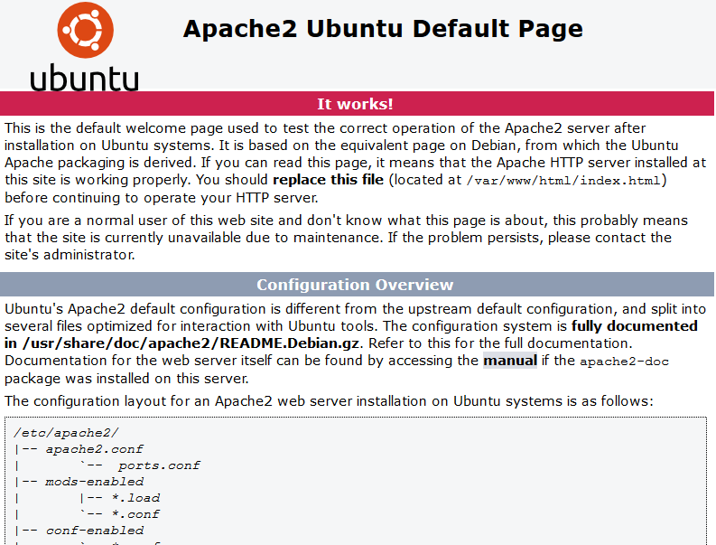
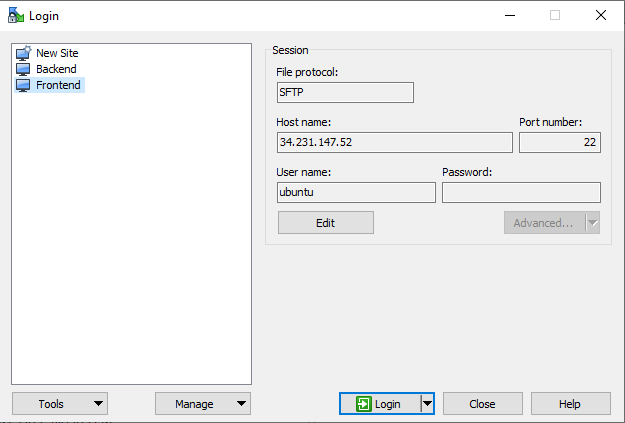
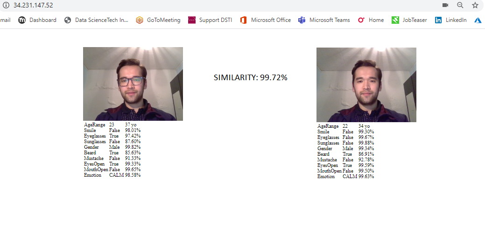

# Rekognition
Making a face recognition system by using AWS Rekognition API

## In this project we are going to deploy 3 servers on AWS Cloud:
- Frontend on Apache web server
- Backend using flask package
- S3 storage

Let's start with Frontend
## Frontend
- EC2 instance: Ubuntu free tier
- Attach to VPC and Public Subnet
- Security Group: TCP 22 from your IP, HTTP 80, Custom TCP 5000
- Connect to EC2 instance
``ssh -i "<your_keypair.pem>" ubuntu@<PublicIPaddress_of_EC2``
- Installation of Apache server:
 ```
 apt-get update
 sudo apt install apache2
 sudo ufw allow 'Apache'
 sudo ufw status
 sudo systemctl status apache2
 ```
- Go to your EC2 instance using Public IP on browser
- You should see picture as below if it is properly installed:



- Copy files from repository including index.html and Static folder to EC2 instance's folder /var/www/html/. In my case, I used WinSCP to copy  files


- Allow browser to execute your webcam visiting link: *chrome://flags/#unsafely-treat-insecure-origin-as-secure*, paste your Public IP and click on button *enabled*


## Backend
- EC2 instance: Ubuntu free tier
- Attach to VPC and Public Subnet
- Security Group: allow TCP 22 from your IP, Custom TCP 5000
- Connect to EC2 instance: ``ssh -i "<your_keypair.pem>" ubuntu@<PublicIPadress_of_backend>``
- Update and install Anaconda and create a virtual flask environment:
```
sudo apt-get update
wget https://repo.anaconda.com/archive/Anaconda3-2019.03-Linux-x86_64.sh
exit
conda create -n my_flask_env python=3.6
conda activate my_flask_env
pip install Flask
pip install flask_cors
pip install boto3
pip install flask_cors
```
- Setup AWS credentials for boto3:
```
mkdir ~/.aws
nano ~/.aws/credentials
```
- Copy your credentials from Vocareum
```
[default]
aws_access_key_id=...
aws_secret_access_key=...
aws_session_token=...
```
```
nano ~/.aws/config
```
- should look like this:
```
[default]
region = us-east-1
```
- Run Flask
```
python my_rek_app.py
```

## S3 storage
- S3 services on AWS
- Create a bucket (find unique name)
- Security open for public

## Almost final
- In the index.js file, change the IP adress to the Public IP of your backend machine
- Go to your Frontend page

## Voila!
Similarity is 99.72%. AgeRange is a bit wide. Emotion is calm!

